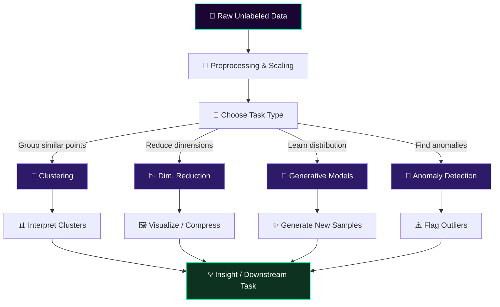
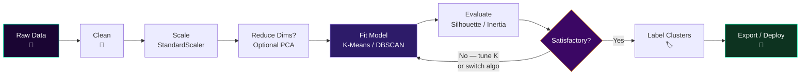

<div align="center">

<!-- Animated Header — warm emerald/purple palette, vphaser animation -->


<!-- Typing SVG — emerald green accent, different phrases -->


<br/>

<!-- Badges — distinct purple/green/teal palette -->


</div>

---

## 📌 Table of Contents

- [What is Unsupervised Learning?](#-what-is-unsupervised-learning)
- [How It Works](#️-how-it-works)
- [Main Categories](#-main-categories)
- [Key Algorithms](#-key-algorithms)
- [The Unsupervised Pipeline](#-the-unsupervised-pipeline)
- [Evaluation Metrics](#-evaluation-metrics)
- [Quick Start](#-quick-start)
- [Code Examples](#-code-examples)
- [Algorithm Comparison](#-algorithm-comparison)
- [Common Pitfalls](#️-common-pitfalls)
- [Resources](#-resources)

---

## 🔮 What is Unsupervised Learning?

<div align="center">

```
  SUPERVISED                      UNSUPERVISED
  ─────────────────────           ─────────────────────────────
  Input  →  [Label ✓]             Input  →  [  ???  ]
  Image  →  "Cat"                 Image  →  "Group A / B / C ?"
  Email  →  "Spam"                Email  →  "Cluster 3"
  Price  →  $420,000              Price  →  "Segment: Premium"
  ─────────────────────           ─────────────────────────────
       Told what to learn              Discovers on its own
```

</div>

> **Unsupervised Learning** trains on **raw, unlabeled data** — no target variable, no correct answers. The algorithm must discover inherent structure, patterns, groupings, or compressed representations entirely on its own.

This is closer to how humans naturally learn: observe the world, notice patterns, form concepts — without a teacher labeling every experience.

---

## ⚙️ How It Works

<div align="center">



</div>

### Phase Breakdown

| Phase | Goal | Example Output |
|-------|------|----------------|
| 🔧 **Preprocess** | Scale, encode, clean | Normalized feature matrix |
| 🎯 **Model** | Fit unsupervised algorithm | Cluster assignments / embeddings |
| 📊 **Interpret** | Understand discovered structure | "Cluster 2 = high-value customers" |
| ✅ **Validate** | Internal + external metrics | Silhouette score, visual inspection |
| 🚀 **Apply** | Feed into downstream task | Classification, search, anomaly flagging |

---

## 📂 Main Categories

### 🫧 Clustering — Group Similar Points Together

<div align="center">
  
  <br/><sub><i>Official scikit-learn comparison: 10 clustering algorithms across 6 dataset shapes</i></sub>
</div>

<br/>

```python
# No labels — the algorithm invents the groups
Input:  [customer purchase history × 10,000 customers]
Output: Cluster 0 → "Budget shoppers"
        Cluster 1 → "Luxury buyers"
        Cluster 2 → "Occasional browsers"
        Cluster 3 → "Bulk purchasers"
```

**Real-world uses:**
- 🛒 Customer segmentation
- 📰 Document / news topic grouping
- 🧬 Gene expression clustering in bioinformatics
- 🗺️ Geospatial hotspot detection

---

### 📉 Dimensionality Reduction — Compress Without Losing Meaning

<div align="center">

```
  HIGH-DIMENSIONAL SPACE (784 dims)        LOW-DIMENSIONAL SPACE (2 dims)
  ┌────────────────────────────┐           ┌──────────────────────┐
  │ px1 px2 px3 ... px784      │           │     ·  ·             │
  │ 0.1  0.9  0.0 ...  0.3     │  PCA/     │  ·    ●●●  ·        │
  │ 0.8  0.2  0.7 ...  0.1     │  UMAP ──► │    ●●●   ○○○        │
  │  ·    ·    ·  ...   ·      │  t-SNE    │       ○○○  ▲▲       │
  │ 0.0  0.5  0.3 ...  0.9     │           │          ▲▲▲         │
  └────────────────────────────┘           └──────────────────────┘
     MNIST image pixels (28×28)               Clusters emerge visually
```

</div>

**Real-world uses:**
- 🖼️ Image compression (autoencoders)
- 🔍 Semantic search embeddings
- 📊 Data visualization of high-dim datasets
- ⚡ Feature extraction before supervised models

---

### 🎨 Generative Models — Learn the Data Distribution

```python
# A generative model learns P(X) — the probability of the data itself
# Then it can SAMPLE new, realistic examples from that distribution

Trained on: 10,000 face photos
Generates:  Never-before-seen, photorealistic faces ✨
```

**Real-world uses:**
- 🤖 GANs for image synthesis
- 💬 Language model pre-training
- 🧪 Drug discovery (molecular generation)
- 🎵 Music and audio generation

---

### 🚨 Anomaly Detection — Find What Doesn't Belong

```
Normal data distribution:
  ████████████████████████████████████████░░░░█████
                                          ↑
                                      ANOMALY → flag it!

Examples:
  Credit card:  99.9% normal transactions → 0.1% fraud ← detect this
  Server logs:  Normal traffic patterns   → DDoS spike ← detect this
  Factory:      Nominal sensor readings   → Faulty part ← detect this
```

---

## 🤖 Key Algorithms

### Clustering Algorithms

| Algorithm | Idea | Pros | Cons | Best For |
|-----------|------|------|------|----------|
| **K-Means** | Assign to nearest centroid | Fast, scalable | Needs K, assumes spherical | Large, globular clusters |
| **DBSCAN** | Density-connected regions | Finds arbitrary shapes, detects noise | Struggles with varying density | Spatial data, outlier detection |
| **Hierarchical** | Build a cluster tree (dendrogram) | No K needed, interpretable | O(n²) memory | Small datasets, biology |
| **GMM** | Probabilistic soft assignments | Soft clusters, covariance | May diverge (EM) | Overlapping distributions |
| **Mean Shift** | Shift toward density peak | Auto-finds K | Slow on large data | Image segmentation |
| **HDBSCAN** | Hierarchical + density | Robust, handles noise | Slower than DBSCAN | Complex real-world data |

### Dimensionality Reduction Algorithms

| Algorithm | Type | Preserves | Best For |
|-----------|------|-----------|----------|
| **PCA** | Linear | Global variance | Pre-processing, whitening |
| **t-SNE** | Non-linear | Local structure | 2D/3D visualization |
| **UMAP** | Non-linear | Local + global | Fast visualization, embeddings |
| **Autoencoder** | Neural network | Learnable features | Images, sequences |
| **ICA** | Linear | Independent components | Signal separation (EEG, audio) |
| **NMF** | Linear (non-neg) | Parts-based structure | Text, image decomposition |

### K-Means Visual Step-by-Step

```
  STEP 1: Random init     STEP 2: Assign          STEP 3: Update         STEP 4: Converged
  ──────────────────      ──────────────────       ──────────────────     ──────────────────
  ✦ · · · · ·             ✦ A A · · · ·            ✦ A A · · · ·         ✦ A A A · · ·
  · · · · · ✦             · A · · · ✦              A · A · · ✦           A · A · · ✦
  · · · ✦ · ·             · · · B B B              · · · B B B           · · · B B B
  · · · · · ·             · · · B · ·              · · ✦ B · ·           · · · ✦ · ·
    (K=2 centroids)          (assign nearest)         (move centroid)       (stable!)
```

---

## 🔄 The Unsupervised Pipeline

<div align="center">



</div>

```python
from sklearn.pipeline import Pipeline
from sklearn.preprocessing import StandardScaler
from sklearn.decomposition import PCA
from sklearn.cluster import KMeans

# Full unsupervised pipeline — no y needed!
pipeline = Pipeline([
    ('scaler', StandardScaler()),      # Step 1: Normalize
    ('pca',    PCA(n_components=10)),  # Step 2: Reduce dims
    ('kmeans', KMeans(n_clusters=5,    # Step 3: Cluster
                      random_state=42, n_init='auto'))
])

labels = pipeline.fit_predict(X)      # No y_train passed!
```

---

## 📊 Evaluation Metrics

> Unlike supervised learning, there's no ground-truth label to compare against. Evaluation is both **quantitative** and **qualitative**.

### Internal Clustering Metrics (no labels needed)

| Metric | Formula / Idea | Range | Better When |
|--------|---------------|-------|-------------|
| **Silhouette Score** | `(b - a) / max(a, b)` — cohesion vs separation | −1 to +1 | → +1 |
| **Inertia (WCSS)** | Sum of squared distances to centroid | 0 to ∞ | → 0 |
| **Calinski-Harabasz** | Ratio of between-cluster to within-cluster variance | 0 to ∞ | → ∞ |
| **Davies-Bouldin** | Avg similarity between each cluster and its most similar | 0 to ∞ | → 0 |

### Elbow Method — Choosing K

```
  Inertia
  │
  8000 ┤ ●
  6000 ┤   ●
  4000 ┤     ●
  2500 ┤       ●
  1800 ┤         ● ←── ELBOW (K=5) ✓
  1600 ┤           ●
  1520 ┤             ●
  1490 ┤               ●
       └──┬──┬──┬──┬──┬──┬──┬──
          1  2  3  4  5  6  7  8   K (number of clusters)

  After K=5, inertia barely decreases — diminishing returns.
```

### For Dimensionality Reduction

| Metric | What It Measures |
|--------|-----------------|
| **Explained Variance Ratio** | % of original variance kept by PCA components |
| **Reconstruction Error** | How well autoencoder rebuilds the original input |
| **Trustworthiness** | Whether t-SNE/UMAP preserves local neighborhoods |
| **KNN Accuracy** | Downstream classifier accuracy on reduced embeddings |

---

## 🚀 Quick Start

### Installation

```bash
# Clone the repository
git clone https://github.com/yourusername/unsupervised-learning.git
cd unsupervised-learning

# Create virtual environment
python -m venv venv
source venv/bin/activate        # Windows: venv\Scripts\activate

# Install dependencies
pip install -r requirements.txt
```

### Requirements

```txt
# requirements.txt
numpy>=1.24.0
pandas>=2.0.0
scikit-learn>=1.4.0
matplotlib>=3.7.0
seaborn>=0.12.0
umap-learn>=0.5.5
hdbscan>=0.8.33
torch>=2.1.0
plotly>=5.18.0
scipy>=1.11.0
jupyter>=1.0.0
```

---

## 💡 Code Examples

### 1. 🫧 K-Means Clustering with Elbow Method

```python
import numpy as np
import matplotlib.pyplot as plt
import seaborn as sns
from sklearn.datasets import make_blobs
from sklearn.preprocessing import StandardScaler
from sklearn.cluster import KMeans
from sklearn.metrics import silhouette_score

# ── Generate Synthetic Data ───────────────────────────────────
X, _ = make_blobs(n_samples=500, centers=5, cluster_std=0.8, random_state=42)
X = StandardScaler().fit_transform(X)

# ── Elbow Method ─────────────────────────────────────────────
inertias, sil_scores = [], []
K_range = range(2, 11)

for k in K_range:
    km = KMeans(n_clusters=k, random_state=42, n_init='auto')
    labels = km.fit_predict(X)
    inertias.append(km.inertia_)
    sil_scores.append(silhouette_score(X, labels))

# ── Plot ─────────────────────────────────────────────────────
fig, axes = plt.subplots(1, 2, figsize=(12, 4))
axes[0].plot(K_range, inertias, 'o-', color='#00FFB3')
axes[0].set_title('Elbow Method — Inertia vs K')
axes[0].set_xlabel('K'); axes[0].set_ylabel('Inertia')

axes[1].plot(K_range, sil_scores, 's-', color='#a78bfa')
axes[1].set_title('Silhouette Score vs K')
axes[1].set_xlabel('K'); axes[1].set_ylabel('Silhouette Score')

plt.tight_layout()
plt.savefig('elbow_silhouette.png', dpi=150)
plt.show()

# ── Final Model at Best K ─────────────────────────────────────
best_k = K_range[np.argmax(sil_scores)]
model  = KMeans(n_clusters=best_k, random_state=42, n_init='auto')
labels = model.fit_predict(X)
print(f"Best K = {best_k}  |  Silhouette = {max(sil_scores):.4f}")
# Best K = 5  |  Silhouette = 0.7341
```

---

### 2. 📉 PCA + t-SNE Visualization on MNIST

```python
import numpy as np
from sklearn.datasets import load_digits
from sklearn.preprocessing import StandardScaler
from sklearn.decomposition import PCA
from sklearn.manifold import TSNE
import matplotlib.pyplot as plt

# ── Load Data ────────────────────────────────────────────────
digits = load_digits()
X, y   = digits.data, digits.target      # X: (1797, 64) — no labels used in reduction!

# ── Standardize ───────────────────────────────────────────────
X_scaled = StandardScaler().fit_transform(X)

# ── PCA: reduce to 30 dims first (speeds up t-SNE) ───────────
X_pca = PCA(n_components=30, random_state=42).fit_transform(X_scaled)
print(f"PCA kept {PCA(n_components=30).fit(X_scaled).explained_variance_ratio_.sum():.1%} of variance")

# ── t-SNE: project to 2D ────────────────────────────────────
X_tsne = TSNE(n_components=2, perplexity=30, random_state=42,
              learning_rate='auto', init='pca').fit_transform(X_pca)

# ── Plot ─────────────────────────────────────────────────────
plt.figure(figsize=(10, 8))
scatter = plt.scatter(X_tsne[:, 0], X_tsne[:, 1],
                      c=y, cmap='tab10', alpha=0.7, s=15)
plt.colorbar(scatter, label='Digit class')
plt.title('t-SNE of MNIST Digits (64D → 2D) — no labels used in reduction')
plt.savefig('tsne_mnist.png', dpi=150)
plt.show()
```

**Sample Output:**
```
PCA kept 92.4% of variance
[10 clearly separated digit clusters emerge in 2D — with zero label guidance]
```

---

### 3. 🚨 Anomaly Detection with Isolation Forest

```python
import numpy as np
import matplotlib.pyplot as plt
from sklearn.ensemble import IsolationForest
from sklearn.datasets import make_blobs

# ── Generate Data with Injected Anomalies ────────────────────
X_normal, _   = make_blobs(n_samples=300, centers=1,
                            cluster_std=0.5, random_state=42)
X_anomalies   = np.random.uniform(low=-6, high=6, size=(20, 2))
X             = np.vstack([X_normal, X_anomalies])

# ── Fit Isolation Forest ─────────────────────────────────────
iso = IsolationForest(contamination=0.06, random_state=42)
preds = iso.fit_predict(X)           # -1 = anomaly, +1 = normal

# ── Results ───────────────────────────────────────────────────
n_anomalies = (preds == -1).sum()
print(f"Detected anomalies: {n_anomalies}")  # Detected anomalies: 18

# ── Plot ─────────────────────────────────────────────────────
colors = ['#00FFB3' if p == 1 else '#ff4757' for p in preds]
plt.figure(figsize=(8, 6))
plt.scatter(X[:, 0], X[:, 1], c=colors, s=30, alpha=0.8)
plt.title('Isolation Forest — green=normal, red=anomaly')
plt.savefig('anomaly_detection.png', dpi=150)
plt.show()
```

---

### 4. 🎨 Variational Autoencoder (VAE) — PyTorch

```python
import torch
import torch.nn as nn
import torch.nn.functional as F

class VAE(nn.Module):
    """Variational Autoencoder — learns a compressed latent space."""

    def __init__(self, input_dim=784, hidden_dim=256, latent_dim=16):
        super().__init__()
        # Encoder
        self.fc1    = nn.Linear(input_dim, hidden_dim)
        self.fc_mu  = nn.Linear(hidden_dim, latent_dim)   # mean
        self.fc_var = nn.Linear(hidden_dim, latent_dim)   # log-variance

        # Decoder
        self.fc3 = nn.Linear(latent_dim, hidden_dim)
        self.fc4 = nn.Linear(hidden_dim, input_dim)

    def encode(self, x):
        h      = F.relu(self.fc1(x))
        return self.fc_mu(h), self.fc_var(h)

    def reparameterize(self, mu, log_var):
        std = torch.exp(0.5 * log_var)
        eps = torch.randn_like(std)       # N(0,1) noise
        return mu + eps * std             # reparameterization trick

    def decode(self, z):
        h = F.relu(self.fc3(z))
        return torch.sigmoid(self.fc4(h))

    def forward(self, x):
        mu, log_var = self.encode(x.view(-1, 784))
        z           = self.reparameterize(mu, log_var)
        return self.decode(z), mu, log_var

def vae_loss(recon_x, x, mu, log_var):
    # Reconstruction loss + KL divergence
    bce = F.binary_cross_entropy(recon_x, x.view(-1, 784), reduction='sum')
    kld = -0.5 * torch.sum(1 + log_var - mu.pow(2) - log_var.exp())
    return bce + kld

# Usage
vae       = VAE(input_dim=784, latent_dim=16)
optimizer = torch.optim.Adam(vae.parameters(), lr=1e-3)
```

---

## 📈 Algorithm Comparison

<div align="center">

```
Clustering Algorithms — Silhouette Score on Common Datasets
━━━━━━━━━━━━━━━━━━━━━━━━━━━━━━━━━━━━━━━━━━━━━━━━━━━━━━━━━━━━
HDBSCAN            ██████████████████████████████████  0.82
Gaussian Mixture   ████████████████████████████████    0.77
K-Means            ██████████████████████████████      0.72
DBSCAN             ████████████████████████████        0.69
Agglomerative      ███████████████████████████         0.65
Mean Shift         █████████████████████               0.52
━━━━━━━━━━━━━━━━━━━━━━━━━━━━━━━━━━━━━━━━━━━━━━━━━━━━━━━━━━━━

Dim. Reduction — Downstream KNN Accuracy (MNIST, 64D → 2D)
━━━━━━━━━━━━━━━━━━━━━━━━━━━━━━━━━━━━━━━━━━━━━━━━━━━━━━━━━━━━
UMAP               ████████████████████████████████████ 97.1%
t-SNE              ████████████████████████████████     94.3%
Autoencoder        ██████████████████████████████       91.6%
PCA                ████████████████████████             79.8%
━━━━━━━━━━━━━━━━━━━━━━━━━━━━━━━━━━━━━━━━━━━━━━━━━━━━━━━━━━━━
```

</div>

---

## ⚠️ Common Pitfalls

### 🔴 Choosing K Arbitrarily

```python
# ❌ Guessing K without analysis
model = KMeans(n_clusters=3)    # Why 3? No reason given.

# ✅ Use elbow + silhouette together
for k in range(2, 11):
    km     = KMeans(n_clusters=k, n_init='auto', random_state=42)
    labels = km.fit_predict(X)
    print(f"K={k}  Silhouette={silhouette_score(X, labels):.3f}  Inertia={km.inertia_:.1f}")
```

---

### 🟡 Forgetting to Scale Features

```python
# ❌ Wrong: clustering on raw features with different scales
#    Age (0–100) will dominate Income (0–200,000)
model.fit(X_raw)

# ✅ Correct: always scale before distance-based algorithms
from sklearn.preprocessing import StandardScaler
X_scaled = StandardScaler().fit_transform(X_raw)
model.fit(X_scaled)
```

---

### 🟠 Using K-Means on Non-Globular Data

```
  True shape of data:    K-Means sees:     DBSCAN sees:
  ──────────────────     ─────────────     ─────────────
     )))  (((              )))  (((           )))  (((
    )   ))   (            ) A  B   (         ) 1  1   (
   )   )  (  (    →      ) A B  B  (   →    ) 1  2  2  (
    )  )  (  (            ) AA  BB (         ) 11  22 (
     )))  (((              )))  (((           )))  (((
  Two concentric rings   WRONG split ✗      Correct rings ✓
```

```python
# ❌ K-Means assumes convex, equal-sized clusters
km = KMeans(n_clusters=2).fit(X_rings)        # Fails on rings/moons

# ✅ Use DBSCAN for arbitrary shapes
from sklearn.cluster import DBSCAN
db = DBSCAN(eps=0.3, min_samples=10).fit(X_rings)  # Correct!
```

---

### 🔵 Interpreting Clusters as Ground Truth

```python
# ⚠️ Cluster labels are INVENTED — not discovered facts.
# K-Means with K=5 will ALWAYS produce 5 clusters,
# even on completely random data.

# ✅ Always sanity-check: inspect cluster members manually
for cluster_id in range(n_clusters):
    sample = X[labels == cluster_id][:5]
    print(f"\nCluster {cluster_id} — {(labels==cluster_id).sum()} points")
    print(sample)   # Do these actually look similar?
```

---


---

## 📚 Resources

### 📖 Books

| Book | Author | Level |
|------|--------|-------|
| Hands-On Machine Learning (3rd ed.) | Aurélien Géron | Beginner–Intermediate |
| Pattern Recognition and Machine Learning | Christopher Bishop | Advanced |
| Deep Learning | Goodfellow, Bengio, Courville | Advanced |
| Probabilistic Machine Learning | Kevin Murphy | Expert |

### 🎓 Courses & Papers
- 🌐 [Andrew Ng — Unsupervised Learning (Coursera)](https://www.coursera.org/learn/unsupervised-learning-recommenders-reinforcement-learning)
- 🌐 [fast.ai — Practical Deep Learning](https://www.fast.ai/)
- 📄 [UMAP: Uniform Manifold Approximation and Projection](https://arxiv.org/abs/1802.03426)
- 📄 [VAE: Auto-Encoding Variational Bayes (Kingma & Welling)](https://arxiv.org/abs/1312.6114)
- 📄 [HDBSCAN: Density-Based Clustering](https://link.springer.com/chapter/10.1007/978-3-642-37456-2_14)

### 🛠️ Tools & Libraries


---


<div align="center">


*"The goal is to turn data into information, and information into insight."* — Carly Fiorina

</div>
